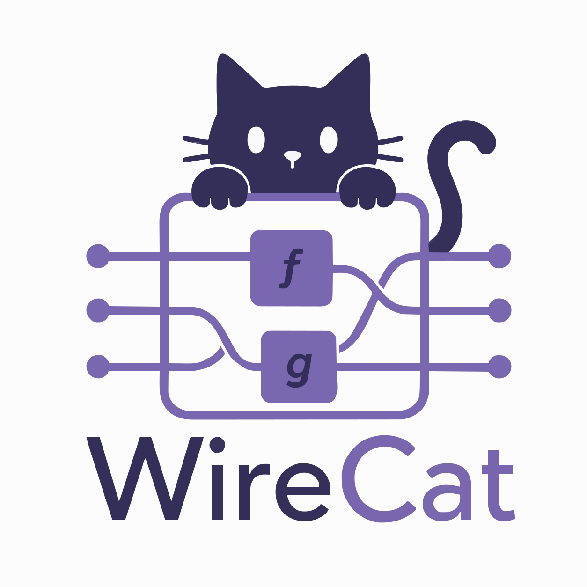
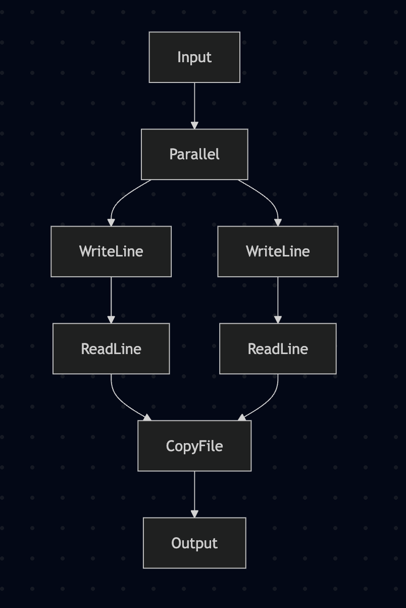
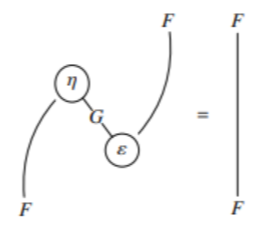

The main bottleneck in programming is not in code production, but in code understanding. This became even more pronounced with the monumental quantities of code AI is capable of producing. This means we desperately need tools that help us manage this uncontrolled growth.

Aiming for correct and intelligible code is not new, and most software engineering patterns have this exact goal. In the context of Haskell, we have a wealth of patterns, effect libraries, etc. The question is which ones are also well adapted to this new reality.

The approach I want to take here is to use effects that allow a _graphical representation of code_. That is, tools that allow us to look at code in a way that is _equivalent_ to the code that is written.

{ width=50% }

In short, WireCat is a GHC plugin, a library, and a visualization tool based on cartesian categories and extensible records that allows us to write code like this:

```haskell
wordCount :: WordCount :> cat => cat Empty Empty
wordCount = proc R {} -> do
  R {path} <- readPath -< R {}
  R {text} <- loadText -< R {path}
  R {words} <- countWords -< R {text}
  R {lines} <- countLines -< R {text}
  R {chars} <- countChars -< R {text}
  writeReport -< R {path, words, lines, chars}
```

That can be interpreted in IO, or rendered like this:


The operations become nodes, and the fields in the records become named ports. The same definition can be run with a concrete interpreter, captured as a free categorical term, or exported as DOT, SVG, and JSON for the viewer.

The motivation for this series of posts was Chris Penner's post on using [Arrows to sequence effects](https://chrispenner.ca/posts/arrow-effects), which I highly recommend. However, the solution I propose here is not arrows, but instead the closely related _cartesian categories_. The code for the plugin was heavily based on [overloaded](https://github.com/phadej/overloaded) by Oleg Grenrus.

The goal of this blog post is to explain why I think this is the right abstraction. In the following posts I will discuss further details like desugaring, dealing with cases (i.e. bicategories), how to use this as an effects library, etc.

WireCat is highly experimental code, and can change at any moment, which means that care is advised. At the moment the plugin covers the cartesian fragment: composition, projection, combination, relabeling, and primitive operations. Case analysis is still future work.

Ideas and collaborations are always welcome!

# Code and graphs

Programs always have two layers -- one is the _structure_ of the code, and the other is its _interpretation_. We write code in text, which has syntax that gives structure to it, and when the code is run, we interpret it.

If we try to represent all code graphically, we can end up with something like Scratch, which exists, but is hard to manipulate at larger scales. The control flow of complex software can be very complicated, and its graphical representation is no less complicated. Any sufficiently detailed description of software will tend towards [code itself](https://haskellforall.com/2026/03/a-sufficiently-detailed-spec-is-code).

However, in Haskell it's very easy to define EDSLs that add an extra level to it. We have a data structure that itself is interpreted as Haskell code, which is then interpreted again. That is, we can define an _intermediate language_ that we choose to represent graphically, and that has good properties. This intermediate language, however, will be non-exhaustive and have details left to interpretation.

# Cartesian categories and string diagrams

In Chris' post we can see the graphical representation of many programs:



These graphs are very similar to something in category theory: _string diagrams_. These diagrams give a very powerful equational language to reason about definitions and propositions. In mathematical texts they will look like this, with operations as nodes, and objects as wires:



So, if we can produce such images with arrows, why not use them? What makes the arrow diagrams not as powerful is `arr`. Indeed we can see this in the definition of `CommandRecorder`:

```haskell
instance Arrow CommandRecorder where
  arr _ = CommandRecorder []
```

which means that when we translate to the visual language, we lose information.

The problem is that `arr` lets arbitrary Haskell functions enter the arrow. Once that happens, the graph can no longer faithfully represent the internal structure of the program; it can only record that some opaque Haskell computation happened there.

Cartesian categories don't have this problem, as they are essentially `Arrow` without `arr`. This means we can recover the structure of the code directly from its graphical representation.

The price is that the set of programs we can write in this language is more restricted. And what we lose is essentially the possibility of having `let` blocks in the code.

So how can we manipulate values?

# Manipulating and naming wires

The fundamental idea of a cartesian category is that there is a concept of product. Elements can be composed and decomposed via products. In the arrow typeclass, this can be seen for example in:

```haskell
(&&&) :: a b c -> a b c' -> a b (c, c')
```

However, manipulating tuples is messy. You have to deal with association laws saying that `(a,(b,c))` is equivalent to `((a,b),c)`, and so on.

A more ergonomic solution is using row types. Essentially, instead of having nested products, we have records with named fields:

```haskell
type Person =
  Rec
    ( "name"   .== String
   .+ "age"    .== Int
   .+ "active" .== Bool
    )

person :: Person
person =
     #name   .== "Alice"
  .+ #age    .== 42
  .+ #active .== True
```

Besides making the associativity/permutation problems go away, we now have *names* for attributes. That is what lets us have named ports in our wire diagrams.

# Writing and interpreting a program

We start by describing the actions we support. In the compact syntax used by WireCat, that looks like this:

```haskell
[effect|
WordCount
  ReadPath    :: {} -> { path :: FilePath }
  LoadText    :: { path :: FilePath } -> { text :: String }
  CountWords  :: { text :: String } -> { words :: Int }
  CountLines  :: { text :: String } -> { lines :: Int }
  CountChars  :: { text :: String } -> { chars :: Int }
  WriteReport :: { path :: FilePath, words :: Int, lines :: Int, chars :: Int } -> {}
|]
```

Every effect can be interpreted in its free cartesian category, which gives us an effect graph, and that's how we generate the wire diagrams:

```haskell
toGraph :: ToLabel op => Free op r s -> Graph (Rec r) (Rec s)
```

Execution is given by an `Interpret` instance:

```haskell
instance Interpret (KleisliRec IO) WordCount where
  --
  interpret ReadPath = KleisliRec $ \_ -> do
    putStr "Path: "
    p <- getLine
    pure (#path .== p)
  --
  interpret LoadText = KleisliRec $ \r -> do
    t <- readFile (r .! #path)
    pure (#text .== t)
  --
  interpret CountWords = KleisliRec $ \r ->
    pure (#words .== length (words (r .! #text)))
  --
  interpret CountLines = KleisliRec $ \r ->
    pure (#lines .== length (lines (r .! #text)))
  --
  interpret CountChars = KleisliRec $ \r ->
    pure (#chars .== length (r .! #text))
  --
  interpret WriteReport = KleisliRec $ \r -> do
    putStr $
      unlines
        [ "path: " ++ r .! #path,
          "words: " ++ show (r .! #words),
          "lines: " ++ show (r .! #lines),
          "chars: " ++ show (r .! #chars)
        ]
    pure empty
```


And the actual code can be run with:

```haskell
wordCountIO :: Empty -> IO Empty
wordCountIO = runKleisliRec wordCount
```

Remember the quasiquoter from before? It exists because the effect definition is repetitive in its expanded form. Conceptually, for each action in `WordCount a b`, the first argument is the input for the action, and the second argument is the output:

```haskell
data WordCount a b where
  -- | Prompt for the input file path.
  ReadPath ::
    WordCount
      (Rec Empty)
      (Rec ("path" .== FilePath))
  -- | Load the file contents from the path.
  LoadText ::
    WordCount
      (Rec ("path" .== FilePath))
      (Rec ("text" .== String))
  -- | Count whitespace-delimited words in the text.
  CountWords ::
    WordCount
      (Rec ("text" .== String))
      (Rec ("words" .== Int))
  -- | Count newline-delimited lines in the text.
  CountLines ::
    WordCount
      (Rec ("text" .== String))
      (Rec ("lines" .== Int))
  -- | Count characters in the text.
  CountChars ::
    WordCount
      (Rec ("text" .== String))
      (Rec ("chars" .== Int))
  -- | Write the word, line, and character counts for the file.
  WriteReport ::
    WordCount
      (Rec ("path" .== FilePath .+ "words" .== Int .+ "lines" .== Int .+ "chars" .== Int))
      (Rec Empty)

```

The expanded form also needs some helpers to run these effects:

```haskell
readPath :: (WordCount :> cat) => cat Empty ("path" .== FilePath)
readPath = interpret ReadPath

loadText :: (WordCount :> cat) => cat ("path" .== FilePath) ("text" .== String)
loadText = interpret LoadText

countWords :: (WordCount :> cat) => cat ("text" .== String) ("words" .== Int)
countWords = interpret CountWords

countLines :: (WordCount :> cat) => cat ("text" .== String) ("lines" .== Int)
countLines = interpret CountLines

countChars :: (WordCount :> cat) => cat ("text" .== String) ("chars" .== Int)
countChars = interpret CountChars

writeReport ::
  (WordCount :> cat) =>
  cat
    ("path" .== FilePath .+ "words" .== Int .+ "lines" .== Int .+ "chars" .== Int)
    Empty
writeReport = interpret WriteReport
```

Here we find the notation `:>`, which means that we can interpret an effect in a cartesian category.

This is the boilerplate that the quasiquoter replaces.

# Conclusion

The interesting part, to me, is that the program has a real executable interpretation and a real graphical interpretation, without making the diagram a lossy trace.

This opens several possible directions. For example, it should be possible to have a purely graphical code editor for it -- it's just a graph manipulation tool. This allows a clear separation between specification and implementation at different levels. For example, defining the graph and letting an LLM write the implementation.

At the same time, the best way to organize, compose and layer code is not obvious. And this is one of the questions I want to tackle in the next posts.
