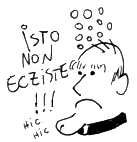

Há poucos dias cheguei em Nápoles. O povo comunicativo (e que não fala inglês) me forçou a aprender um italiano macarrônico. Metade é inventado, mas algumas palavras são surpreendentemente corretas. Pensei um pouco o porquê, e logo ficou claro: rock progressivo italiano.

Tive essa fase da adolescência em que eu escutava o auge do que o país tinha a oferecer nos anos 70: [Area](https://open.spotify.com/track/0TPr5hnZsUpJcibgC9U4OS?si=154888fdec5a4c7e), [Alphataurus](https://open.spotify.com/track/1B4XcCAhhj6r2ji1dcISEU?si=fbffb2f2ee1b4d67), [Arti+Mestieri](https://open.spotify.com/track/2kDIE7NIvWqXNMhOSjsyws?si=728597664b1c4456), [Banco del Mutuo Soccorso](https://open.spotify.com/track/6wNZa5e5DVBwMbqB4uYuXp?si=6e8c418a88104fd9), [Le Orme](https://open.spotify.com/track/0d2bqsRMRjb5ozBip9RIWH?si=9a3f26e8c7c34f36), [Il Balletto di Bronzo](https://open.spotify.com/track/0ptQ18rVtULNMT9w87ECpH?si=ad480122ca4f4bd1), [Museo Rosenbach](https://open.spotify.com/track/1WWvR06pxjJF2Djp6xZ6zX?si=83c732f05f6d49b9), [Premiata Forneria Marconi](https://open.spotify.com/track/2Pxrc170vjMuvDmoFzoGNo?si=f48530945e8a4ea9), etc, etc etc... Música exuberante, muito técnica, emocional, filosófica, socialmente engajada, cheia de excessos, brega pra caralho. Maravilhoso. E nos meus momentos de tédio, traduzia palavra por palavra para entender as letras.

Todo este preâmbulo para chegar ao assunto, como eu conheci essa bagaça toda. E a fonte é o blog do santíssimo [Padre Levedo](https://www.geocities.ws/padrelevedo/).  Blog este que desapareceu da web por usar o lendário `hgp.ig.com.br` para o hosting. Alguns destroços deste website podem ser encontrados ainda em um mirror que fiz [aqui](https://xyah.github.io/). 

Sujeito este que não lembro como encontrei na internet do passado, mas que produziu pérolas tais quais:

> Dizem-me, as pessoas com as quais convivo, que estamos nesta existência por uma única razão: movimento. (...) Movimento, não só o físico. Grande parte da nossa vida consiste em movimento da Mente. Deus nos concedeu uma enorme máquina de fliperama que está localizada entre nossas orelhas. O cérebro, uma das muitas maravilhas criadas pelo Onissapiente (entre elas a graviola e a Jennifer Lopez), é uma espécie de pokemón ensandecido, gerando sempre bilhares de pensamentos por segundo.

que termina com uma recomendação de leituras para sua "Correta e Perfeita Formação Intelectual" (sic), ou ainda:

> Gosh, às vezes penso que não tem ninguém mais Fodão do que Deus. Pra um sujeito fazer o que ele faz com os recursos que possui, pourra, vou lhes falar. Algumas dezenas de cromossomos e o cara faz uma Camila Pitanga. Não contente com isso, faz uma Ana Hickmann na seqüência. Eu, como todo sujeito sensível à Experiência Estética, penso que Deus, na sua Eterna Onipotência, deva assistir às tentativas que o Homem faz de capturar a Beleza. Todas as Artes, tudo, toda a literatura, toda a música, toda a pintura, toda Arte Dramática, tudo isto. E Deus - imagino - olha pra tudo isto e diz - ouquei, mas vejam só isto. E cria, não uma supermodel, mas a menina que fará você, amanhã cedo, virar o rosto, respirar fundo e pensar: caraio! Quantas vezes você fez isto por uma sinfonia de Mozart?

seguido por por uma tradução de um poema de William Blake. Como uma [música das núvens e do chão](https://open.spotify.com/track/0ohKztSTnSBUpWOsFN0YHC?si=140b1434fc1c42b4). O conteúdo deste blog teve uma profunda influência no meu gosto por literatura, música e artes em geral.

O momento mais marcante foi quando eu, com meus quatorze anos, estava convencido que não gostava de música. Quando colegas ou professores me perguntavam minha banda preferida, eu não sabia dizer, ou copiava o que um outro amigo tinha dito.

Até que um dia o padre falou de uma tal Mahavishnu Orchestra. Achei o nome curioso, e entrei no site de músicas do Terra (antigo...) e com sofrimento, do alto da minha internet discada do iBest, consegui ouvir [Meeting of the Spirits](https://open.spotify.com/track/3zTPm7WbVCByG66AOqkMNZ?si=743dbea389574b37). E a partir daí, tudo mudou.

Fiquei noites e noites baixando albums em torrent, frequentando o forum do SoundChaser (onde lia recomendações do emérito Alfredo), e ouvido músicas obscuras. Demorou até a faculdade pra conhecer alguém que ouvisse as mesmas bizarrices que eu, e que por acaso virou um dos meus melhores amigos: o Igor.

Nos encontramos num momento duplamente surpreendente. Estávamos os dois fazendo a prova para fazer intercâmbio na École Polytechnique, e na saída ele me ofereceu uma carona até o IF. No porta CD do carro, a capa inconfundível do Ceux du Dehors, do Univers Zéro (que na época era pronunciado como seuxdudeórs). Nós dois passamos, e nos vemos até hoje.

E tudo isso que me levou até hoje, ouvindo Alphataurus para treinar meu italiano, vai que me serve amanhã...

> All'improvviso
> Vedi un fiore
> Respiri l'aria
> Raccogli un fiore
> Che cosa eri
> Non lo sai più
>
> Un viale lungo
> Davanti a te
> Alberi immensi
> Sul tuo cammino
> Una ragiong
> Per vivere c'è
